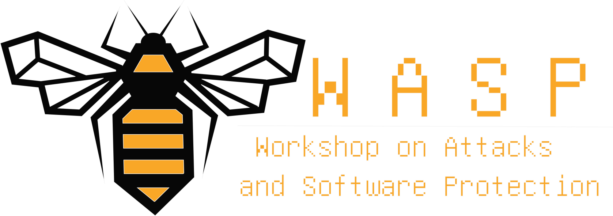

{:class="img-responsive"}
{:class="img-responsive" style="max-width: 50%"}

{: style="text-align: center"}
## WASP @ ESORICS 2023

{: style="text-align: center"}
## Workshop on Attacks and Software Protection

{: style="text-align: justify"}
With the ever-increasing spread of software attacks, the need for software protection has
become more crucial than ever. In recent years, we have witnessed a rise in cyber attacks
targeting software and the valuable information it holds, leading to significant financial and
reputational damage to businesses and individuals alike.

{: style="text-align: justify"}
The _Workshop on Attacks and Software Protection_ (_WASP_), aims to bring together experts and researchers in the field of software protection to
share their insights and ideas on the latest trends, challenges, and opportunities in this area.
Specifically, WASP focuses on program protection and reverse engineering techniques that
can be used for both legitimate and malicious purposes, such as malware research and
analysis, and protection schemes for intellectual property and commercial software.

{: style="text-align: justify"}
The anticipated benefits to the community include a deeper understanding of software
security, new research directions, and practical insights to improve the protection of
software. This workshop will provide a forum for lively discussions, knowledge sharing, and
networking among participants, and will foster collaborations and partnerships between
academia and industry.
